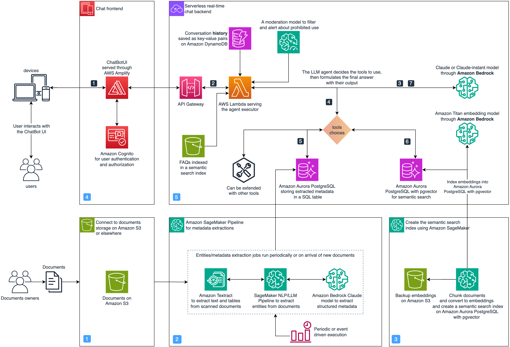

# Agentic Documents Assistant

The *Agentic Documents Assistant* is an LLM assistant that allows users to answer complex questions from their business documents through natural conversations.
It supports answering factual questions by retrieving information directly from documents using semantic search with the popular RAG design pattern.
Additionally, it answers analytical questions such as *which contracts will expire in the next 3 months?* by translating user questions into SQL queries and running them against a database of entities extracted from the documents using a batch process.
It is also able to answer complex multi-step questions by combining retrieval, analytical, and other tools and data sources using an LLM agent design pattern.

To learn more about the design and architecture of this solution, check the accompanying AWS ML blog post:
[Boosting RAG-based intelligent document assistants using entity extraction, SQL querying, and agents with Amazon Bedrock](https://aws.amazon.com/blogs/machine-learning/boosting-rag-based-intelligent-document-assistants-using-entity-extraction-sql-querying-and-agents-with-amazon-bedrock/).

## Key Features

- Semantic search to augment response generation with relevant documents
- Structured metadata & entities extraction and SQL queries for analytical reasoning
- An agent built with the Reason and Act (ReAct) instruction format that determines whether to use search or SQL to answer a given question.

## Architecture Overview

The following architecture diagrams depicts the design of the solution.

## Content

Below an outline of the main folders included in this asset.

| Folder | Description |
| ----------- | ----------- |
| `backend` | Includes a Typescript CDK project implementing IaaC to setup the backend infrastructure. |
| `frontend` | A Typescript CDK project to setup infrastructure for deploying and hosting the frontend app with AWS Amplify. |
| `frontend/chat-app` | A Next.js app with AWS Cognito Authentication and secured backend connectivity. |
| `data-pipelines` | Notebooks implementing SageMaker Jobs and Pipeline to process the data in batch. |
| `experiments` | Notebooks and code showcasing different modules of the solution as standalone experiments for research and development. |

## Getting Started

Follow the insturctions below to setup the solution on your account.

### Prerequisites

- An AWS account.
- [Configure model access](https://docs.aws.amazon.com/bedrock/latest/userguide/model-access.html#add-model-access) to Anthroptic Claude and Amazon Titan models in one of [the supported regions of Amazon Bedrock](https://docs.aws.amazon.com/bedrock/latest/userguide/what-is-service.html#bedrock-regions).
- setup [AWS Cloud Development Kit (CDK)](https://aws.amazon.com/cdk/):
    - We recommend using a [Cloud9 environment](https://docs.aws.amazon.com/cloud9/latest/user-guide/tutorial-create-environment.html) or [CloudShell](https://aws.amazon.com/cloudshell/) to install the cdk app.
    - Alternatively, you can setup CDK in your local environment by following the [documentation instructions](https://docs.aws.amazon.com/cdk/v2/guide/getting_started.html#getting_started_prerequisites).

### Installation

To install the solution in your AWS account:

1. Clone this repository.
2. Install the backend [CDK app](https://docs.aws.amazon.com/cdk/v2/guide/home.html), as follows:
    1. Go inside the `backend` folder.
    2. Run `npm install` to install the dependencies.
    3. If you have never used CDK in the current account and region, run [bootstrapping](https://docs.aws.amazon.com/cdk/v2/guide/bootstrapping.html) with `npx cdk bootstrap`.
    4. Run `npx cdk deploy` to deploy the stack.
    5. Take note of the SageMaker IAM Policy ARN found in the CDK stack output.
3. Deploy the Next.js frontend on AWS Amplify:
    1. Go inside the `fontend` folder.
    2. Run `npm install` to install the dependencies.
    3. Run `npx cdk deploy` to deploy a stack that builds an Amplify CI/CD
    4. Once the CI/CD is ready go to the Amplify console and trigger a build.
    5. Once the app is built, click the hosting link to view. You can now create a new account and interact with agentic assistant.
4. To update the underlying data, run the SageMaker Pipeline notebooks under the `data-pipelines` folder. This processes the input pdf documents, prepares the SQL table, and creates the semantic search index used by the LLM assistant.

### Clean up

To remove the resources of the solution:

1. Remove the stack inside the `backend` folder by running `npx cdk destroy`.
2. Remove the stack inside the `frontend` folder by running `npx cdk destroy`.

## Authors

The authors of this asset are:

* [Mohamed Ali Jamaoui](https://www.linkedin.com/in/mohamedalijamaoui/): Solution designer/Core maintainer.
* Giuseppe Hannen: Extensive contribution to the data extraction modules.
* Laurens ten Cate: Contributed to extending the agent with SQL tool and early streamlit UI deployments.

## Security

See [CONTRIBUTING](CONTRIBUTING.md#security-issue-notifications) for more information.

## References

* [Best practices for working with AWS Lambda functions](https://docs.aws.amazon.com/lambda/latest/dg/best-practices.html).
* [Langchain custom LLM agents](https://python.langchain.com/docs/modules/agents/how_to/custom_llm_agent)
* [LLM Powered Autonomous Agents](https://lilianweng.github.io/posts/2023-06-23-agent/)

## Future improvements

- [ ] Improve the overall-inference speed.

## License

This library is licensed under the MIT-0 License. See the LICENSE file.
